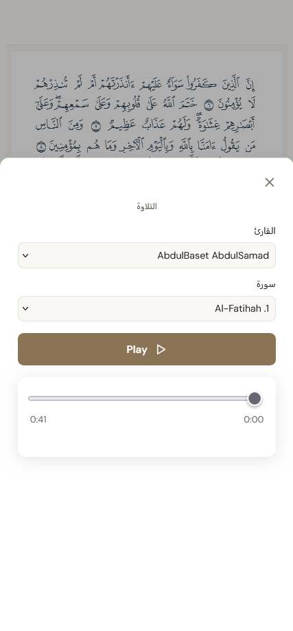

# open-quran-view

[NPM Package](https://www.npmjs.com/package/open-quran-view)
·
[Interactive Docs](https://adelpro.us.kg/open-quran-view/)
·
[Advanced Demo (Mubin)](https://mubin.adelpro.us.kg)
·
[Advanced Source (Mubin)](https://github.com/adelpro/mubin)
·
[Basic Demo](https://open-quran-view-react.netlify.app/)
·
[Basic Source](https://github.com/adelpro/open-quran-view-react)

High-performance universal Quran rendering library using Quran Foundation API.

`open-quran-view` provides React and Web Component views for rendering Quran pages with high fidelity.

---

## 🌟 Advanced Showcase: Mubin

For a fully-featured, production-grade application leveraging `open-quran-view` for advanced interactions, check out **[Mubin](https://mubin.adelpro.us.kg)** ([GitHub Repository](https://github.com/adelpro/mubin)).



Mubin demonstrates production-grade features built on top of this package, including:
- **Word-Level Audio Highlight Synchronization**: Synchronized reciter audio utilizing Quran Foundation timestamps.
- **Word-Level Tafseer Popup**: Clicking individual words overlays a translation and Tafseer definition.
- **Ayah-Level Tafseer trigger**: Tapping the verse markers shows full Ayah-level translation and commentary.
- **Responsive Layout**: Adapts dynamically across desktop, tablet, and mobile screens.

Read our [Advanced Showcase Guide](docs/guides/advanced-guide.md) to learn how to implement these patterns in your own app.

---

## Features

- **Quran Foundation API** - Uses Quran Foundation API for platform-agnostic data.
- **Universal Views** - React component and Vanilla Web Component with consistent API.
- **TypeScript First** - Built with TypeScript for a robust development experience.
- **Static Assets** - Self-contained fonts and metadata included in package.
- **Word-Level Interactivity** - Click on words for tafseer and explanations.
- **Multiple Mushaf Layouts** - Support for Hafs V2, Hafs V4, and Hafs Unicode.

---

## Project Structure

```
open-quran-view/
├── src/
│   ├── core/               # Platform-agnostic core logic
│   │   ├── static/         # Static asset URLs
│   │   ├── data-loader.ts  # Data loading with caching
│   │   ├── font-loader.ts  # Font loading
│   │   └── lookup.ts       # Navigation & verse lookup
│   ├── view/
│   │   ├── react/          # React component
│   │   └── web/            # Web Component
│   ├── data/               # Quran Foundation API data assets (generated)
├── docs/                   # Documentation
├── scripts/                # Data generation scripts
├── playground/             # React & Web Component development playgrounds
└── dist/                   # Build output
```

---

## Getting Started

### Installation

```bash
npm install open-quran-view
```

### React Component

```tsx
import { OpenQuranView } from 'open-quran-view/view';

function App() {
  return (
    <OpenQuranView
      page={1}
      mushafLayout="hafs-v2"
      width={600}
      height={850}
      onWordClick={(word) => console.log(word)}
    />
  );
}
```

Explicit imports:

```tsx
import { OpenQuranView } from 'open-quran-view/view/react';
```

### Web Component

```html
<script type="module">
  import { registerOpenQuranView } from 'open-quran-view/view/web';
  registerOpenQuranView();
</script>

<open-quran-view page="1" mushaf-layout="hafs-v2" width="600" height="850"></open-quran-view>
```

TypeScript:

```tsx
import { registerOpenQuranView, type OpenQuranViewElement } from 'open-quran-view/view/web';
registerOpenQuranView();

const viewer = document.querySelector('open-quran-view') as OpenQuranViewElement;
viewer.page = 1;
viewer.setAttribute('mushaf-layout', 'hafs-v2');
```

---

## API Reference

### React Component (`@open-quran-view/view`)

```tsx
import { OpenQuranView, type OpenQuranViewProps } from 'open-quran-view/view';

<OpenQuranView
  page={1}
  width={600}
  height={850}
  theme="light"
  mushafLayout="hafs-v2"
  onPageChange={(page) => console.log(page)}
  onLoad={(layout) => console.log(layout)}
  onWordClick={(word) => console.log(word)}
/>
```

**Props:**

| Prop | Type | Default | Description |
|------|------|---------|-------------|
| `page` | number | `1` | Page number (1-604) |
| `width` | number | `600` | Component width in pixels |
| `height` | number | `850` | Component height in pixels |
| `theme` | `"light" \| "dark"` | `"light"` | Color theme |
| `mushafLayout` | `"hafs-v2" \| "hafs-v4" \| "hafs-unicode"` | `"hafs-v2"` | Mushaf layout |
| `onPageChange` | `(page: number) => void` | - | Called when page changes |
| `onLoad` | `(layout: PageLayout) => void` | - | Called when page loads |
| `onWordClick` | `(word: WordInfo) => void` | - | Called when word is clicked |
| `highlightedWords` | `WordLocation[]` | `[]` | List of words to highlight |
| `highlightedVerse` | `{ surah: number, verse: number } \| null` | `null` | Verse to highlight (line background) |
| `wordHighlightColor` | `string` | `"rgba(255, 215, 0, 0.5)"` | Word highlight color |
| `verseHighlightColor` | `string` | `"rgba(135, 206, 250, 0.25)"` | Verse highlight color |
| `className` | string | - | CSS class for container |

type WordInfo = {
  id: number;
  surahNumber?: number;
  ayahNumber?: number;
};

type WordLocation = {
  surah: number;
  verse: number;
  position: number;
};
```

### Web Component (`@open-quran-view/view/web`)

```typescript
import { registerOpenQuranView, type OpenQuranViewProps } from 'open-quran-view/view/web';
registerOpenQuranView();
```

**Attributes:**

| Attribute | Type | Default | Description |
|-----------|------|---------|-------------|
| `page` | string | `"1"` | Page number (1-604) |
| `mushaf-layout` | string | `"hafs-v2"` | Mushaf layout |
| `width` | string | `"600"` | Component width in pixels |
| `height` | string | `"850"` | Component height in pixels |
| `theme` | string | `"light"` | Color theme (`light` or `dark`) |
| `highlighted-words` | string | `undefined` | JSON string of `WordLocation[]` |
| `highlighted-verse` | string | `undefined` | JSON string of `{ surah: number, verse: number }` |
| `word-highlight-color` | string | `"rgba(255, 215, 0, 0.5)"` | Word highlight color |
| `verse-highlight-color` | string | `"rgba(135, 206, 250, 0.25)"` | Verse highlight color |

**Events:**

| Event | Detail | Description |
|-------|--------|-------------|
| `load` | `PageLayout` | Fired when page loads |
| `pagechange` | `{ page: number }` | Fired when page changes |
| `wordclick` | `WordInfo` | Fired when a word is clicked |

**JavaScript API:**

```typescript
const viewer = document.querySelector('open-quran-view') as OpenQuranView;

viewer.page = 10;
viewer.goToPage(10);
console.log(viewer.page);
viewer.setAttribute('mushaf-layout', 'hafs-v4');
viewer.setAttribute('theme', 'dark');

// Highlighting API
viewer.wordsHighlight = [{ surah: 1, verse: 1, position: 1 }];
viewer.verseHighlight = { surah: 1, verse: 1 };
viewer.wordHighlightColorOverride = 'rgba(255, 0, 0, 0.3)';
```

---

## Mushaf Layouts

| Layout | Description | Preview |
|--------|-------------|---------|
| `hafs-v2` | Hafs from Asim via the way of Warsh |  |
| `hafs-v4` | Hafs from Asim via the way of Shu'bah (with Tajweed) |  |
| `hafs-unicode` | Standard Unicode Quran (Digital Khatt) |  |

---

### Bismillah Rendering

Bismillah is rendered correctly across all layouts following Quranic rules:

| Surah | Behavior |
|-------|----------|
| Surah 1 (Al-Fatiha) | Bismillah shown as Ayah 1 | ✅ |
| Surah 9 (At-Tawbah) | No Bismillah shown | ✅ |
| All other Surahs | Decorative centered Bismillah line after Surah header | ✅ |

Each layout uses its own dedicated font for Bismillah rendering:
- `hafs-unicode` → DigitalKhatt font
- `hafs-v2` → Hafs v2 font (BismillahFont)
- `hafs-v4` → Hafs v4 font (BismillahFont)

---

## Documentation

See [`docs/`](docs/) directory for:

- [API Reference](docs/api/views.md) - Detailed views module documentation
- [Architecture](docs/architecture/data-structure.md) - Data structures and file formats
- [Architecture](docs/architecture/static-assets.md) - Static assets system (v0.2.0+)
- [Guides](docs/guides/font-loading.md) - Font loading strategy

---

## Scripts

| Script | Description |
|--------|-------------|
| `yarn generate:all` | Download fonts + fetch data + generate all static assets |
| `yarn generate:static:fonts` | Download fonts from Quran Foundation API and generate font URLs |
| `yarn generate:static:data` | Fetch Quran data from Quran Foundation API and generate page layouts |
| `yarn build` | Build the package |
| `yarn prepare` | Auto-generate + build on install |
| `yarn test` | Run tests |
| `yarn lint` | Lint code |

---

## Development

```bash
# Install dependencies
yarn install

# Generate static assets
yarn generate:all

# Build package
yarn build

# Run development playground
yarn playground:setup
yarn playground:react
yarn playground:web
```

---

## 🚀 Porting to Other Frameworks (Flutter, Swift, Kotlin, Vue...)

`open-quran-view` is built on a **data-first and specification-first architecture**. 

While this repository maintains official rendering views for **React** and **Vanilla Web Components**, the underlying Quranic page layouts, metadata, and font glyph structures are completely framework-agnostic. 

If you are a mobile developer (Flutter, Swift, Kotlin) or a frontend developer using other frameworks (Vue, Svelte, Angular, SolidJS), we highly encourage you to build your own native views using our pre-generated specifications:

### How to Port:
1.  **Consume the Specification**: Read the [Data Structure Reference](docs/architecture/data-structure.md) to understand the coordinate mapping, word elements, line structure, and metadata arrays.
2.  **Retrieve the Font Assets**: Use the WOFF2 font files per page layout (`data/fonts/` or fetched from CDN) to load fonts dynamically in your environment.
3.  **Map Coordinates & Tap Handlers**:
    *   In **Flutter**, draw the page structure inside a `CustomPainter` and use a `GestureDetector` to map coordinates to word boundaries.
    *   In **Vue/Svelte**, wrap the Vanilla Web Component (`open-quran-view/view/web`) or build native canvas/SVG-based components.
    *   In **native iOS (Swift) / Android (Kotlin)**, draw the text layouts using native Canvas text rendering.

If you build an adapter, wrapper, or port for another framework, submit a PR! We would love to link your repository as an official community-supported view in this section.

---

Jazakum Allahu Khairan
