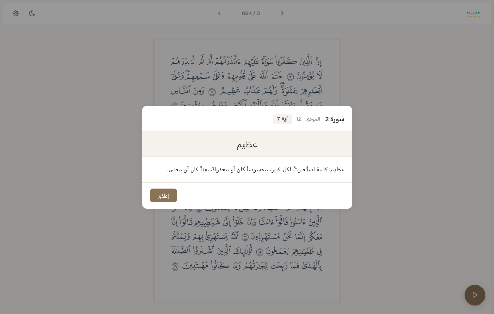
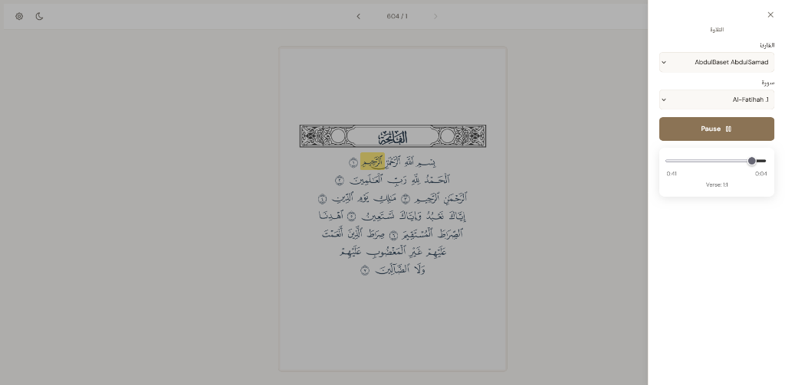
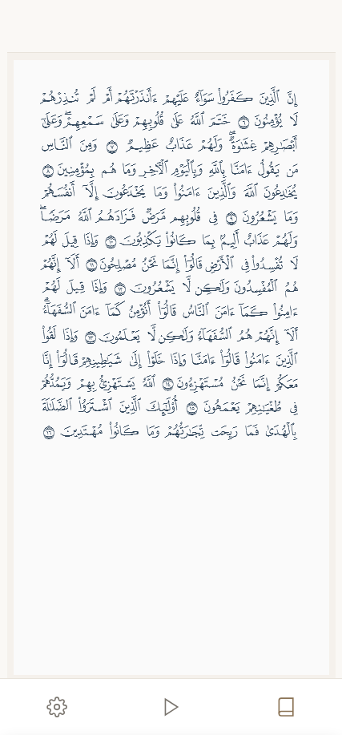

# Advanced Showcase Guide: Mubin Implementation

This guide covers advanced integration patterns used in the production-grade application **Mubin** (`https://mubin.adelpro.us.kg` / `github.com/adelpro/mubin`), which is built as the official showcase for `open-quran-view`.

Mubin synchronizes reading, audio recitation, and Tafseer on a single page, providing a premium, interactive experience for users. Below, we break down how to implement these capabilities using `open-quran-view`'s core APIs.

---

## 🎵 1. Word-Level Audio Highlight Synchronization

Synchronizing audio recitation with real-time word highlighting is one of the most powerful features of `open-quran-view`.

### Visual Showcase (Mubin Audio Sync)

Here is how the audio sync highlighted view renders in Mubin on desktop, with the active word dynamically highlighted in gold and the audio controls panel docked on the right:


### Core Synchronization Architecture

1. **Get Audio & Segment Data**: Fetch audio files and corresponding word-level timing offsets (timestamps) from the [Quran Foundation API](https://quran.com/developers).
2. **Setup Audio State**: Maintain an HTML5 `Audio` instance and listen to its `timeupdate` event.
3. **Parse and Find Active Word**: On each `timeupdate`, check the `audio.currentTime` (in milliseconds) and find the word whose start and end times encompass this value.
4. **Update Highlight State**: Update the `highlightedWords` prop of the React component (or corresponding Web Component attribute) to trigger immediate, high-fidelity highlight updates.

### React Code Implementation Example

Here is a simplified pattern showing how Mubin manages this synchronization in React:

```tsx
import React, { useState, useEffect, useRef } from 'react';
import { OpenQuranView } from 'open-quran-view/view';

interface WordSegment {
  wordPosition: number; // 1-indexed position inside the verse
  startTime: number;    // In milliseconds
  endTime: number;      // In milliseconds
}

interface VerseTiming {
  surah: number;
  verse: number;
  segments: WordSegment[];
}

export function AdvancedAudioSyncViewer() {
  const [currentPage, setCurrentPage] = useState(1);
  const [highlighted, setHighlighted] = useState<any[]>([]);
  const [isPlaying, setIsPlaying] = useState(false);
  
  const audioRef = useRef<HTMLAudioElement | null>(null);
  
  // Timing segments for active verse (Fetched from Quran Foundation API)
  const [timingData, setTimingData] = useState<VerseTiming>({
    surah: 1,
    verse: 2,
    segments: [
      { wordPosition: 1, startTime: 0, endTime: 600 },
      { wordPosition: 2, startTime: 600, endTime: 1200 },
      { wordPosition: 3, startTime: 1200, endTime: 2100 },
      { wordPosition: 4, startTime: 2100, endTime: 3000 }
    ]
  });

  useEffect(() => {
    // Instantiate audio element
    audioRef.current = new Audio('https://audio.qurancdn.com/Abdul_Basit_Murattal/mp3/001002.mp3');

    const handleTimeUpdate = () => {
      if (!audioRef.current) return;
      
      const currentTimeMs = audioRef.current.currentTime * 1000;
      
      // Find the segment matching the current playback time
      const activeSegment = timingData.segments.find(
        (segment) => currentTimeMs >= segment.startTime && currentTimeMs <= segment.endTime
      );

      if (activeSegment) {
        // Pass the exactly formatted WordLocation to open-quran-view
        setHighlighted([
          {
            surah: timingData.surah,
            verse: timingData.verse,
            position: activeSegment.wordPosition,
          }
        ]);
      } else {
        setHighlighted([]);
      }
    };

    const audio = audioRef.current;
    audio.addEventListener('timeupdate', handleTimeUpdate);
    
    return () => {
      audio.removeEventListener('timeupdate', handleTimeUpdate);
      audio.pause();
    };
  }, [timingData]);

  const togglePlay = () => {
    if (!audioRef.current) return;
    if (isPlaying) {
      audioRef.current.pause();
    } else {
      audioRef.current.play();
    }
    setIsPlaying(!isPlaying);
  };

  return (
    <div>
      <button onClick={togglePlay}>{isPlaying ? 'Pause Recitation' : 'Play Recitation'}</button>
      
      <OpenQuranView
        page={currentPage}
        mushafLayout="hafs-v2"
        width={500}
        height={700}
        highlightedWords={highlighted}
        wordHighlightColor="rgba(212, 175, 55, 0.4)" // Soft Gold Highlight
      />
    </div>
  );
}
```

---

## 📖 2. Interactive Word-Level Tafseer Popup

Clicking on a specific word allows developers to display word-by-word translations or root-word analysis (Tafseer).

### Visual Showcase (Mubin Tafseer Dialog)

When a user taps or clicks a word in Mubin, a responsive modal overlays the page with structural definitions:



### Implementation Mechanics

Listen to the `onWordClick` event, which exposes word properties such as `id`, `surahNumber`, and `ayahNumber` (or the `position`). Using these identifiers, you can query your Tafseer dataset or API and trigger a modal popup.

```tsx
import React, { useState } from 'react';
import { OpenQuranView } from 'open-quran-view/view';

export function InteractiveTafseerReader() {
  const [selectedWord, setSelectedWord] = useState<any | null>(null);

  const handleWordClick = async (wordInfo: any) => {
    // wordInfo exposes: { id, surahNumber, ayahNumber, position }
    console.log("Clicked word metadata:", wordInfo);
    
    // Fetch word Tafseer/translation from Quran Foundation or local dictionary
    const tafseerText = await fetchTafseerForWord(wordInfo.surahNumber, wordInfo.ayahNumber, wordInfo.position);
    
    setSelectedWord({
      ...wordInfo,
      text: tafseerText
    });
  };

  return (
    <div style={{ position: 'relative' }}>
      <OpenQuranView
        page={2}
        mushafLayout="hafs-v2"
        width={500}
        height={700}
        onWordClick={handleWordClick}
      />

      {/* Tafseer Dialog Modal Overlay */}
      {selectedWord && (
        <div className="tafseer-modal">
          <h3>Word Tafseer Info</h3>
          <p>Surah {selectedWord.surahNumber}, Ayah {selectedWord.ayahNumber}</p>
          <div className="content">{selectedWord.text}</div>
          <button onClick={() => setSelectedWord(null)}>Close</button>
        </div>
      )}
    </div>
  );
}

// Dummy fetch function
async function fetchTafseerForWord(surah: number, ayah: number, pos: number) {
  return `Tafseer/meaning definition for Surah ${surah}, Verse ${ayah}, Word position ${pos}`;
}
```

---

## 🎯 3. Verse-Level (Ayah Marker) Interaction

In the Mushaf rendering, each verse terminates with a numbered verse end marker (Ayah Marker). Users often expect that clicking this marker displays the full, comprehensive Tafseer for that entire verse.

To implement this:
1. Capture the general coordinate clicks or capture events from `onWordClick`.
2. Since some verse markers in font rendering are coded as specific words (often the final word of the Ayah), checking the clicked word's properties can identify if it is a verse marker.
3. Once detected, fetch the full verse translation/Tafseer and open a dedicated sidebar or modal showing the full commentary, similar to the word-level popup.

---

## 📱 4. Mobile Reading Optimization

Mubin demonstrates that `open-quran-view` is fully responsive and offers comfortable reading layouts on mobile devices.

### Visual Showcase (Mubin Mobile layouts)

Here are the mobile recitation drawer and reading views demonstrating perfect high-fidelity Mushaf scaling:

| Mobile Drawer Selector | Mobile High-Fidelity Reading |
| :---: | :---: |
|  |  |

To support responsive layouts, adjust the `width` and `height` properties of the `<OpenQuranView />` component based on screen boundaries or window resize events.
